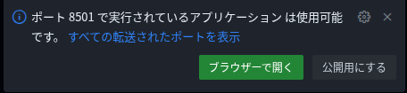
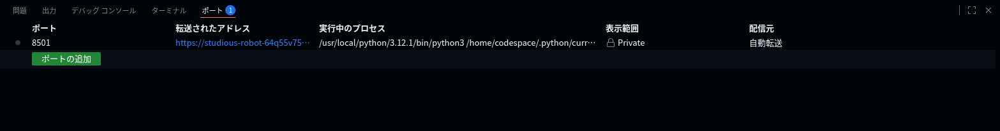

# Day1 ローカル開発環境のセットアップ

教材に従わず、GitHub Codespacesで対応

## Python環境のインストール

GitHub CodespacesのデフォルトのDev Containerを使うため不要

## Streamlitライブラリのインストール

```bash
pip install streamlit
```

## Streamlitデモアプリの起動

```bash
streamlit hello
```

ポート転送のポップアップが出るので、ブラウザーから開くを押してアクセスする。




ポップアップが消えてしまった場合、「ターミナル」の隣の「ポート」メニューから転送されたアドレス


